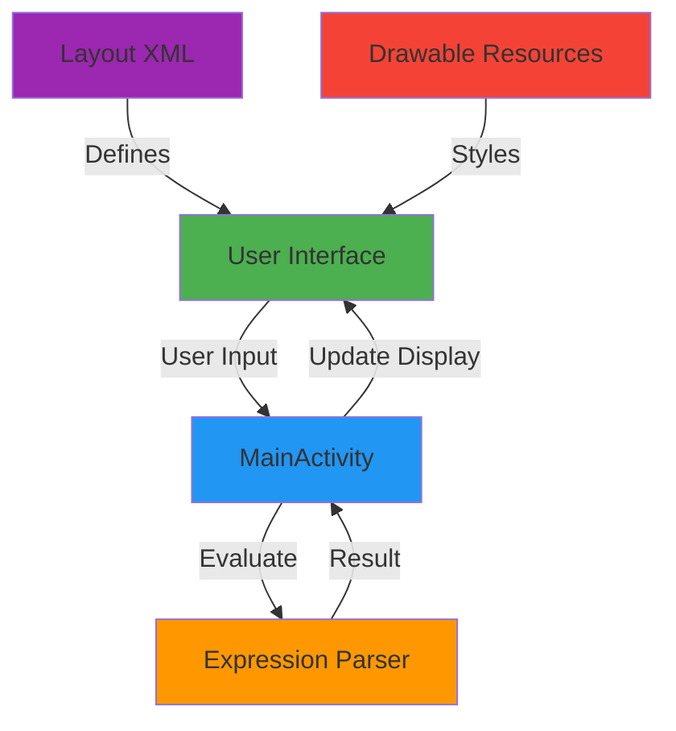
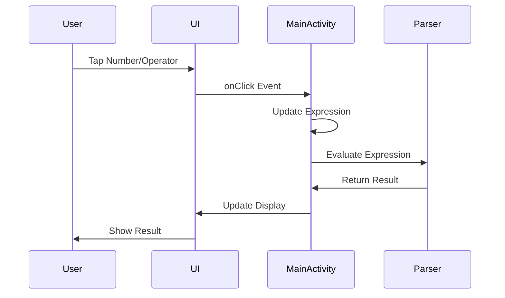

# SuperCalculator

<div align="center">
  
  
  
  
</div>

<div align="center">
  <h3>A modern, elegant calculator app for Android</h3>
  <p>Built with native Android components and Material Design principles</p>
</div>

---

## 📖 Introduction

SuperCalculator is a sleek, user-friendly calculator application designed for Android devices. Inspired by modern calculator interfaces, it provides essential arithmetic operations with a clean, dark-themed UI that's easy on the eyes and intuitive to use.

Whether you're doing quick calculations on the go or need a reliable tool for everyday math, SuperCalculator delivers a smooth, responsive experience with real-time result preview and intelligent input handling.

### Why SuperCalculator?

- **Clean Interface**: Minimalist design focused on usability
- **Real-time Preview**: See results as you type
- **Smart Input**: Intelligent operator handling and error prevention
- **Responsive Design**: Optimized for various screen sizes
- **Native Performance**: Built with native Android components for maximum efficiency

---

## ✨ Key Features

### Core Functionality
- ✅ **Basic Arithmetic Operations**: Addition, subtraction, multiplication, and division
- ✅ **Decimal Support**: Full floating-point number support with smart decimal handling
- ✅ **Real-time Calculation**: Live result preview in the result holder
- ✅ **Expression Evaluation**: Proper operator precedence (PEMDAS/BODMAS)

### User Experience
- 🎨 **Dark Theme**: Eye-friendly dark interface with high contrast
- 📱 **Responsive Layout**: Adaptive text sizing for long expressions
- ⌨️ **Smart Input**: Prevents invalid expressions and duplicate operators
- 🔄 **Quick Clear**: AC button for instant reset, DEL for character-by-character deletion

### Advanced Features
- 🔢 **Percentage Calculation**: Quick percentage conversion
- ➕➖ **Sign Toggle**: Negate numbers with +/- button
- 📊 **Auto-formatting**: Clean number display without trailing zeros
- 🎯 **Error Handling**: Graceful error management with user feedback

---

## 🏗️ Overall Architecture

SuperCalculator follows the **Model-View-Controller (MVC)** pattern adapted for Android development:



### Component Breakdown

#### 1. **Presentation Layer**
- `activity_main.xml`: Defines the UI layout with RelativeLayout
- Custom button styles with Material Design principles
- Responsive TextViews with auto-sizing capabilities

#### 2. **Business Logic Layer**
- `MainActivity.java`: Core application logic and event handling
- Expression evaluation engine with proper operator precedence
- Input validation and formatting utilities

#### 3. **Resource Layer**
- Drawable resources for button styling
- Color schemes and theme definitions
- String resources for localization support

### Data Flow



---

## 🚀 Installation

### Prerequisites

Before you begin, ensure you have the following installed:

- **Android Studio**: Arctic Fox (2020.3.1) or later
- **JDK**: Java Development Kit 11 or higher
- **Android SDK**: API Level 24 (Android 7.0) or higher
- **Gradle**: 7.0+ (included with Android Studio)

### Step-by-Step Installation

1. **Clone the Repository**
   ```bash
   git clone https://github.com/yourusername/SuperCalculator.git
   cd SuperCalculator
   ```

2. **Open in Android Studio**
   - Launch Android Studio
   - Select `File > Open`
   - Navigate to the cloned directory
   - Click `OK` to open the project

3. **Sync Gradle**
   - Android Studio will automatically prompt to sync Gradle
   - Click `Sync Now` in the notification bar
   - Wait for dependencies to download

4. **Configure SDK**
   - Go to `File > Project Structure > SDK Location`
   - Ensure Android SDK path is correctly set
   - Verify SDK Platform 24+ is installed

5. **Build the Project**
   ```bash
   ./gradlew build
   ```

---

## ▶️ Running the Project

### On Physical Device

1. **Enable Developer Options**
   - Go to `Settings > About Phone`
   - Tap `Build Number` 7 times
   - Enable `USB Debugging` in Developer Options

2. **Connect Device**
   - Connect your Android device via USB
   - Accept USB debugging prompt on device

3. **Run Application**
   - Click the `Run` button (▶️) in Android Studio
   - Select your device from the list
   - Wait for installation and launch

### On Emulator

1. **Create AVD (Android Virtual Device)**
   - Open `Tools > AVD Manager`
   - Click `Create Virtual Device`
   - Select a device definition (e.g., Pixel 5)
   - Choose system image (API 24+)
   - Click `Finish`

2. **Launch Emulator**
   - Select your AVD from the device dropdown
   - Click `Run` button (▶️)
   - Wait for emulator to boot

### Using Gradle Command Line

```bash
# Debug build
./gradlew installDebug

# Release build (requires signing configuration)
./gradlew installRelease
```

---

## ⚙️ Environment Configuration

### Build Configuration

The project uses Gradle Kotlin DSL for build configuration. Key settings in `app/build.gradle.kts`:

```kotlin
android {
    namespace = "com.example.supercalculater"
    compileSdk = 36
    
    defaultConfig {
        applicationId = "com.example.supercalculater"
        minSdk = 24
        targetSdk = 36
        versionCode = 1
        versionName = "1.0"
    }
    
    compileOptions {
        sourceCompatibility = JavaVersion.VERSION_11
        targetCompatibility = JavaVersion.VERSION_11
    }
}
```

### Dependencies

```kotlin
dependencies {
    implementation("androidx.appcompat:appcompat:1.7.1")
    implementation("com.google.android.material:material:1.13.0")
    implementation("androidx.activity:activity:1.13.0")
    implementation("androidx.constraintlayout:constraintlayout:2.2.1")
}
```

### Local Properties

Create `local.properties` in the root directory:

```properties
sdk.dir=/path/to/your/Android/sdk
```

### Gradle Properties

Configure `gradle.properties` for build optimization:

```properties
org.gradle.jvmargs=-Xmx2048m -Dfile.encoding=UTF-8
android.useAndroidX=true
android.enableJetifier=true
```

---

## 📁 Folder Structure

```
SuperCalculator/
├── .gradle/                    # Gradle cache and build files
├── .idea/                      # Android Studio project settings
├── app/
│   ├── build/                  # Compiled output
│   ├── src/
│   │   ├── main/
│   │   │   ├── java/com/example/supercalculater/
│   │   │   │   └── MainActivity.java          # Main application logic
│   │   │   ├── res/
│   │   │   │   ├── drawable/                  # Button styles and shapes
│   │   │   │   │   ├── btn_gray_dark.xml     # Dark button background
│   │   │   │   │   ├── btn_gray_light.xml    # Light button background
│   │   │   │   │   ├── btn_orange.xml        # Operator button background
│   │   │   │   │   └── circle_button.xml     # Circular button shape
│   │   │   │   ├── layout/
│   │   │   │   │   └── activity_main.xml     # Main UI layout
│   │   │   │   ├── mipmap-*/                 # App icons (various densities)
│   │   │   │   ├── values/
│   │   │   │   │   ├── colors.xml            # Color definitions
│   │   │   │   │   ├── strings.xml           # String resources
│   │   │   │   │   └── themes.xml            # App theme
│   │   │   │   └── xml/
│   │   │   │       ├── backup_rules.xml      # Backup configuration
│   │   │   │       └── data_extraction_rules.xml
│   │   │   └── AndroidManifest.xml           # App manifest
│   │   ├── androidTest/                      # Instrumented tests
│   │   └── test/                             # Unit tests
│   ├── build.gradle.kts                      # App-level build config
│   └── proguard-rules.pro                    # ProGuard rules
├── gradle/
│   ├── libs.versions.toml                    # Dependency versions
│   └── wrapper/                              # Gradle wrapper files
├── build.gradle.kts                          # Project-level build config
├── settings.gradle.kts                       # Project settings
├── gradle.properties                         # Gradle properties
├── gradlew                                   # Gradle wrapper (Unix)
├── gradlew.bat                               # Gradle wrapper (Windows)
└── README.md                                 # This file
```

### Key Files Explained

| File | Purpose |
|------|---------|
| `MainActivity.java` | Core application logic, event handling, and calculation engine |
| `activity_main.xml` | UI layout definition with buttons and display areas |
| `btn_*.xml` | Custom button background styles with gradients and shapes |
| `build.gradle.kts` | Build configuration, dependencies, and SDK versions |
| `AndroidManifest.xml` | App metadata, permissions, and activity declarations |

---

## 🤝 Contribution Guidelines

We welcome contributions from the community! Here's how you can help make SuperCalculator even better.

### Getting Started

1. **Fork the Repository**
   - Click the `Fork` button on GitHub
   - Clone your fork locally

2. **Create a Branch**
   ```bash
   git checkout -b feature/your-feature-name
   ```

3. **Make Your Changes**
   - Write clean, documented code
   - Follow existing code style
   - Test thoroughly

4. **Commit Your Changes**
   ```bash
   git add .
   git commit -m "feat: add your feature description"
   ```

5. **Push and Create PR**
   ```bash
   git push origin feature/your-feature-name
   ```
   - Open a Pull Request on GitHub
   - Describe your changes clearly

### Commit Message Convention

We follow [Conventional Commits](https://www.conventionalcommits.org/):

- `feat:` New feature
- `fix:` Bug fix
- `docs:` Documentation changes
- `style:` Code style changes (formatting, etc.)
- `refactor:` Code refactoring
- `test:` Adding or updating tests
- `chore:` Maintenance tasks

### Code Style

- **Java**: Follow [Google Java Style Guide](https://google.github.io/styleguide/javaguide.html)
- **XML**: Use 4-space indentation
- **Naming**: Use descriptive, camelCase names
- **Comments**: Document complex logic

### Testing

- Write unit tests for new features
- Ensure all tests pass before submitting PR
- Test on multiple Android versions if possible

### Review Process

1. Maintainers will review your PR
2. Address any requested changes
3. Once approved, your PR will be merged
4. Your contribution will be credited

---

## 📄 License

This project is licensed under the **MIT License** - see below for details:

```
MIT License

Copyright (c) 2026 SuperCalculator Contributors

Permission is hereby granted, free of charge, to any person obtaining a copy
of this software and associated documentation files (the "Software"), to deal
in the Software without restriction, including without limitation the rights
to use, copy, modify, merge, publish, distribute, sublicense, and/or sell
copies of the Software, and to permit persons to whom the Software is
furnished to do so, subject to the following conditions:

The above copyright notice and this permission notice shall be included in all
copies or substantial portions of the Software.

THE SOFTWARE IS PROVIDED "AS IS", WITHOUT WARRANTY OF ANY KIND, EXPRESS OR
IMPLIED, INCLUDING BUT NOT LIMITED TO THE WARRANTIES OF MERCHANTABILITY,
FITNESS FOR A PARTICULAR PURPOSE AND NONINFRINGEMENT. IN NO EVENT SHALL THE
AUTHORS OR COPYRIGHT HOLDERS BE LIABLE FOR ANY CLAIM, DAMAGES OR OTHER
LIABILITY, WHETHER IN AN ACTION OF CONTRACT, TORT OR OTHERWISE, ARISING FROM,
OUT OF OR IN CONNECTION WITH THE SOFTWARE OR THE USE OR OTHER DEALINGS IN THE
SOFTWARE.
```

---

## 🗺️ Roadmap

### Version 1.1 (Q2 2026)
- [ ] **Scientific Mode**: Add trigonometric functions (sin, cos, tan)
- [ ] **History Feature**: Save and recall previous calculations
- [ ] **Themes**: Light theme option and custom color schemes
- [ ] **Haptic Feedback**: Vibration on button press
- [ ] **Landscape Mode**: Optimized layout for horizontal orientation

### Version 1.2 (Q3 2026)
- [ ] **Unit Converter**: Length, weight, temperature conversions
- [ ] **Currency Converter**: Real-time exchange rates
- [ ] **Tip Calculator**: Built-in tip calculation mode
- [ ] **Widget Support**: Home screen calculator widget
- [ ] **Voice Input**: Calculate using voice commands

### Version 2.0 (Q4 2026)
- [ ] **Graphing Calculator**: Plot mathematical functions
- [ ] **Equation Solver**: Solve algebraic equations
- [ ] **Matrix Operations**: Matrix calculator mode
- [ ] **Programming Mode**: Binary, hexadecimal, octal conversions
- [ ] **Cloud Sync**: Sync history across devices

### Long-term Vision
- [ ] **Wear OS Support**: Calculator for smartwatches
- [ ] **Tablet Optimization**: Enhanced UI for larger screens
- [ ] **Accessibility**: Screen reader support and high contrast mode
- [ ] **Localization**: Support for 20+ languages
- [ ] **Open API**: Allow third-party integrations

---

## 🙏 Acknowledgments

- **Material Design**: UI/UX inspiration from Google's Material Design guidelines
- **Android Community**: For excellent documentation and support
- **Contributors**: Thanks to all who have contributed to this project

---

## 📞 Support

- **Issues**: [GitHub Issues](https://github.com/yourusername/SuperCalculator/issues)
- **Discussions**: [GitHub Discussions](https://github.com/yourusername/SuperCalculator/discussions)
- **Email**: support@supercalculator.app

---

<div align="center">
  <p>Made with ❤️ by the SuperCalculator Team</p>
  <p>
    <a href="#supercalculator">Back to Top ↑</a>
  </p>
</div>
